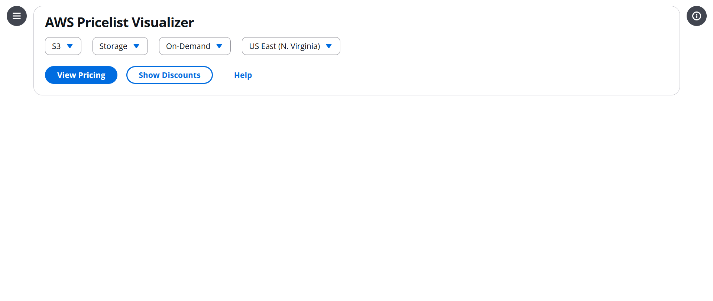

# AWS Pricelist Visualizer

A modern, AWS-style pricing visualizer built with **React**, **TypeScript**, and the **Cloudscape Design System**.  
This project lets users explore and compare AWS service pricing by selecting service, product, duration, and region in an intuitive dashboard.

---
## 🚀 Live Demo

👉 [Try the App on Vercel](https://aws-pricing-visualizer.vercel.app/)

---
## 🚀 Features

- **AWS-style UI** using Cloudscape components for a familiar, professional look
- **Dropdown selectors** for Service, Product, Duration, and Region
- **Responsive and accessible** design
- **Modular structure** for easy extension and integration
- **Ready for real AWS JSON pricing data** (just plug in your files)
- **Future-ready**: Easily add charts, tables, AI chatbot, and more

---

## 📸 Screenshots

---

## 🛠️ Tech Stack

- [React](https://react.dev/)
- [TypeScript](https://www.typescriptlang.org/)
- [Cloudscape Design System](https://cloudscape.design/)
- [Vite](https://vitejs.dev/) (for fast development and build)

---

## 📦 Getting Started

### 1. **Clone the Repository**

git clone https://github.com/yourusername/aws-pricing-visualizer.git
cd aws-pricing-visualizer

### 2. **Install Dependencies**

npm install

### 3. **Run the App Locally**

npm run dev
Then open [http://localhost:5173](http://localhost:5173) in your browser.

---

## 📝 Usage

- Select **Service**, **Product**, **Duration**, and **Region** from the dropdowns.
- Click **View Pricing** to display pricing details (to be connected to real data).
- Use other buttons (e.g., Show Discounts, Help) for additional features.

---

## 🧩 Customization

- **Add your AWS pricing JSON files** to `src/data/`.
- **Extend UI**: Add charts, tables, or chatbot features as needed.
- **Integrate with AWS APIs** or other data sources for real-time pricing.

---

## 🧑‍💻 Contributing

Contributions are welcome! Please open issues or submit pull requests for new features, bug fixes, or improvements.

---

## 📄 License

This project is licensed under the [MIT License](LICENSE).

---

## 🙌 Acknowledgements

- [Cloudscape Design System by AWS](https://cloudscape.design/)
- [React](https://react.dev/)
- [Vite](https://vitejs.dev/)

---

## 📬 Contact

For questions or feedback, open an issue or reach out via [GitHub Discussions](https://github.com/kgurnoor/aws-pricing-visualizer/discussions).

